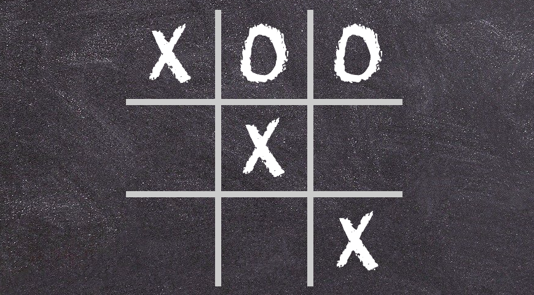

# Tic-Tac-Toe

## General info

Tic-Tac-Toe Game created during learning Vanilla JS, to better understand basic JS concepts and communication with DOM.

## Screenshots

## Technologies

- HTML
- CSS
- Vanilla JS

## Demo

Demo version: https://maciejewskakatarzyna.github.io/Tic-Tac-Toe/

## To-do list:

- Code more responsive layout
- Add Sass

## Status

Project is: _in progress_, I'm still learning JS and trying to use new knowledge in practice!

## Contact

Created by @maciejewska_kas - feel free to contact me!
