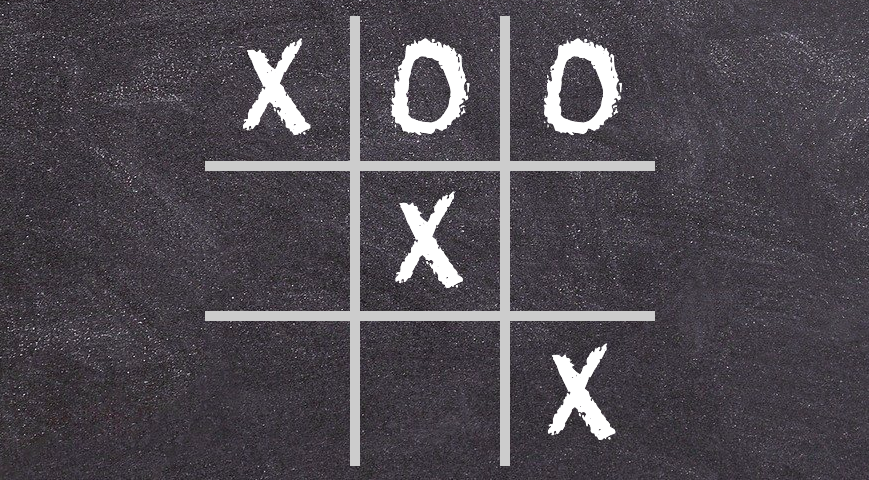

# Tic-Tac-Toe
> Tic-Tac-Toe Game

## Table of contents
* [General info](#general-info)
* [Screenshots](#screenshots)
* [Technologies](#technologies)
* [Demo](#demo)
* [To-do list](#to-do-list)
* [Status](#status)
* [Contact](#contact)

## General info
Tic-Tac-Toe Game created during learning Vanilla JS, to better understand basic JS concepts and communication with DOM.

## Screenshots

## Technologies
* HTML
* CSS
* Vanilla JS

## Demo
Demo version: https://maciejewskakatarzyna.github.io/Tic-Tac-Toe/

## To-do list:
* Code more responsive layout
* Add Sass
* Refactoring into OOP
* Code the same app with React

## Status
Project is: _in progress_, I'm still learning JS and trying to use new knowledge in practice!

## Contact
Created by @maciejewskakatarzyna - feel free to contact me!
